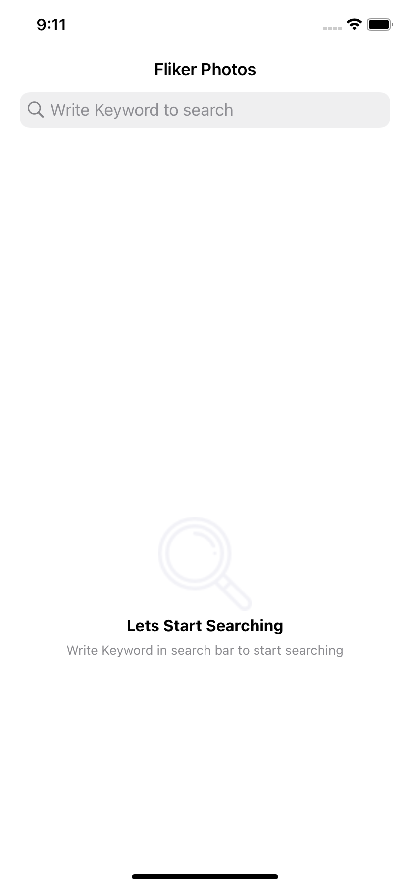
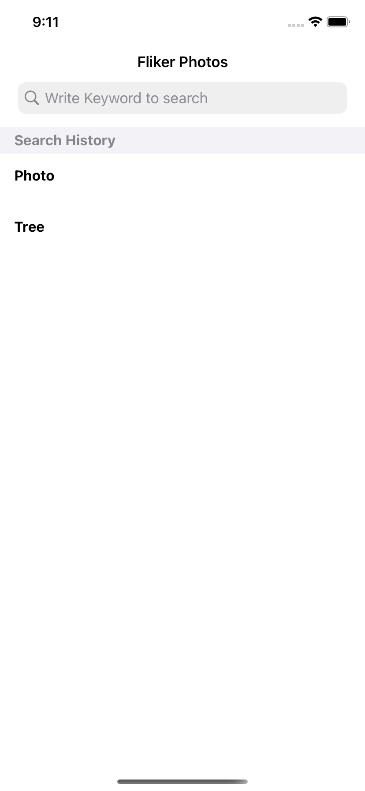

<!-- PROJECT LOGO -->
<br />
<div align="center">
  

  <h3 align="center">Flickr Photos</h3>

  <p align="center">
    Flicker Search API Usage
    <br />
    <a href="https://www.flickr.com/services/api/explore/flickr.photos.search"><strong>Explore the docs »</strong></a>
    <br />
  </p>
</div>


<!-- ABOUT THE TASK -->
## Screen Shoots

            


### Built With


* **MVVM** with **combine & UIKit**.

* **Unit Tests** applied for **(WebPhotos & UserDefaultSearchHistory) Reposatories & PhotosListViewModel**.

* [SwiftLint](https://github.com/realm/SwiftLint) used for correcting code.

* [JSONExport](https://github.com/Ahmed-Ali/JSONExport) to generate model from JSON.

* Cocopods.


### Installation

Follow Steps for running app

1. Clone the repo
   ```sh
   git clone https://github.com/Ahmed-Elsman/FlickrPhotos.git
   ```
3. Install Pods
   ```sh
   pod install
   ```
4. You Can change API_ KEY in `Constants.swift` with yours if this became not valid any more
   ```js
   static let API_KEY: String = 'ENTER YOUR API'
   ```


<!-- CONTACT -->
## Contact

Ahmed Elsman - ahmedelsman0@gmail.com

Task Link: [https://github.com/Ahmed-Elsman/FlickrPhotos](https://github.com/Ahmed-Elsman/FlickrPhotos)
